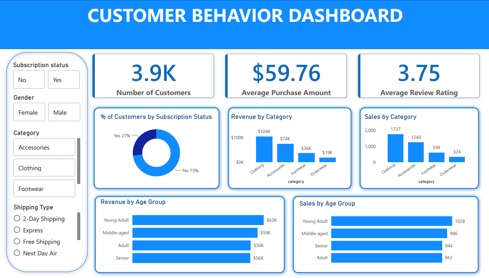

# 🛒 E-Commerce Customer Behavior & Analytics Dashboard

> An end-to-end data analytics project using Python, PostgreSQL, and Power BI.


---

# 📌 Project Overview

This project analyzes a dataset of 3,900 e-commerce customers to extract actionable business insights

Instead of building a complex, multi-page report, this project focuses on delivering a **Single-Page Executive Dashboard**. It provides stakeholders with an immediate, high-level overview of business performance, allowing them to filter data dynamically by subscription status, gender, product category, and shipping type

The project encompasses the entire data pipeline:
1. **Data Preprocessing:** Cleaning and feature engineering using Python (Pandas)
2. **Data Storage & Analysis:** Aggregating data and answering business questions using PostgreSQL
3. **Data Visualization:** Building an interactive dashboard in Power BI

---

# 🎯 Business Questions Addressed

Using SQL and Power BI, this project answers core operational questions
- What is the average purchase amount and average customer review rating?
- Which product categories drive the highest revenue and sales volume?
- How does revenue contribution differ across various age groups (Young Adult, Middle-aged, Senior)?
- What percentage of the customer base is currently subscribed to the membership program?

---

# 📊 The Executive Dashboard



The interactive dashboard provides a snapshot of customer behavior through three main lenses:

### 1️⃣ High-Level KPIs
- **3.9K Customers** analyzed in total
- **$59.76** Average Purchase Amount per transaction
- **3.75 / 5.00** Average Review Rating, indicating moderate-to-good customer satisfaction

### 2️⃣ Category Performance
- **Clothing** is the absolute revenue driver, generating roughly **$104K** with over 1,700 items sold
- **Accessories** follow closely at **$74K** in revenue, whereas Outerwear remains the lowest-performing category

### 3️⃣ Demographics & Loyalty
- **Age Groups:** **Young Adults** are the most lucrative demographic (generating $62K), followed by Middle-aged customers
- **Subscriptions:** Only **27%** of the customer base has opted into the subscription program, leaving a massive 73% as untapped potential for recurring revenue

---

# 💡 Business Recommendations

Based on the dashboard insights, the business should consider the following actions:
1. **Drive Subscription Conversion:** With 73% of customers not subscribed, launching targeted campaigns (e.g., offering a discount on the first month) could significantly boost recurring revenue.
2. **Capitalize on "Young Adults":** Since this group generates the highest revenue and sales volume, marketing channels should heavily target this demographic with trending products.
3. **Bundle Weak Categories:** Outerwear is underperforming. Consider bundling it with the high-selling Clothing category to clear inventory and increase the Average Order Value (AOV).

---

# 🛠 Tech Stack & Repository Structure

- **Python (Pandas):** Handled missing `review_rating` values, created `age_group` brackets, and exported clean data to SQL via SQLAlchemy.
- **PostgreSQL:** Executed complex CTEs and Window Functions to segment customers and rank products.
- **Power BI:** Designed the interactive Executive Dashboard with dynamic slicers.

```text
├── data/
│   └── customer_shopping_behavior.csv    # Raw dataset (3,900 rows)
├── notebooks/
│   └── customer_behavior.ipynb           # Python ETL & Preprocessing[cite: 1]
├── sql/
│   └── customer_behavior_queries.sql     # PostgreSQL analysis queries[cite: 2]
├── dashboard/
│   └── Customer_behavior_dashboard.pbix  # Power BI Dashboard file[cite: 3]
└── docs/
    └── project_report.pdf                # Detailed analysis report